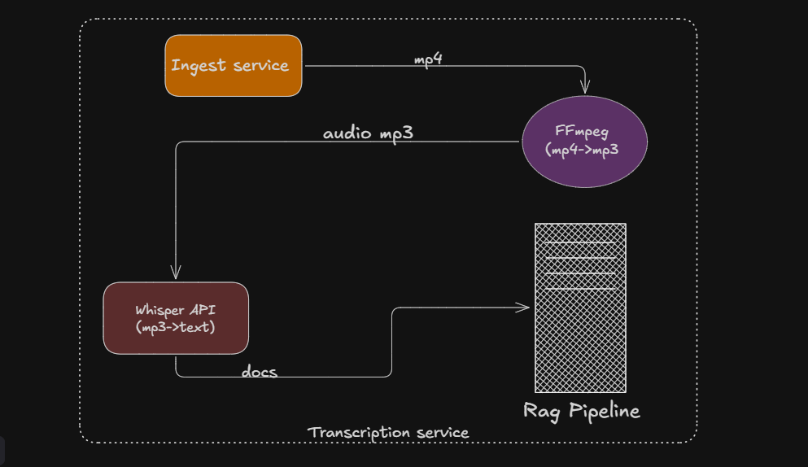
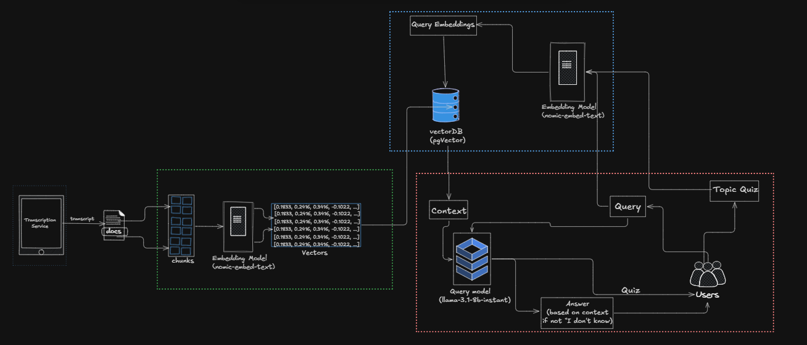

# Learnify — AI-Powered Teaching Assistant

> Upload any PDF or lecture video and instantly chat with it, generate quizzes, and test your knowledge — all powered by RAG (Retrieval-Augmented Generation).

---

## What is Learnify?

Learnify is an AI teaching assistant built with **Spring Boot + Spring AI**. It lets you upload any educational document (textbook, lecture notes, research paper) or video lecture and:

- **Chat with it** — ask questions, get answers grounded strictly in the document
- **Generate MCQ quizzes** — automatically create multiple choice questions from any topic within the content
- **Score your answers** — submit answers and get instant feedback with explanations
- **Ingest video lectures** — upload `.mp4`, `.mkv`, `.avi`, or `.mov` files; audio is extracted and transcribed automatically via Whisper

---

## Architecture

<p align="center">
  
</p>
<p align="center">
  
</p>
<p align="center">
  
</p>

## System Architecture

Learnify is composed of two independent services:

### 1. Spring Boot Backend (`learnify-backend`)
The core Java service that handles:
- REST API for all client interactions
- PDF ingestion and text extraction
- RAG pipeline (chunking → embedding → vector store → LLM)
- Quiz generation and persistence
- Async video processing via RabbitMQ

### 2. Python Transcription Service (`transcription-service`)
A lightweight FastAPI microservice that:
- Accepts video uploads via `POST /transcribe`
- Extracts audio using **FFmpeg** (`pcm_s16le`, 16 kHz, mono)
- Transcribes audio with **Groq Whisper** (`whisper-large-v3`)
- Returns the transcript along with timestamped segments and detected language

---

## Project Structure

```
learnify/
 server/                          # Spring Boot application
    src/main/java/com/LearnifyMajor/server/
        Controller/
           ChatController.java       # POST /api/chat
           QuizController.java       # POST /quiz/generate
           RagController.java        # POST /rag/ingestPdf, /rag/ingestVideo
           TranscriptController.java # POST /video/transcript
        Service/
           RagService.java           # Core RAG: chunking, storing, answering
           IngestServiceImpl.java    # PDF + video ingestion orchestration
           QuizService.java          # MCQ quiz generation via LLM
           VideoService.java         # Job status lookup
        Message/
           BrokerRabbitMQConfig.java    # RabbitMQ queue/exchange/binding
           VideoIngestMessage.java      # Message DTO (jobId, filename, bytes)
           VideoIngestPublisher.java    # Publishes video jobs to queue
           VideoIngestConsumer.java     # Consumes and processes video jobs
           ByteArrayMultipartFileConverter.java  # Reconstructs MultipartFile from bytes
        Client/
           TranscriptionClientService.java      # HTTP client to Python service
           TranscriptionRestClientResponse.java # Response DTO
           RestclientConfig.java                # RestClient bean (10s connect / 10m read)
        Config/
           AppConfig.java            # ChatClient + EmbeddingModel beans
           ModelMapperConfig.java    # ModelMapper bean
           MapperConfig.java         # ObjectMapper (JavaTimeModule)
        Entity/
           Video.java                # Video job entity (jobId, status, fileName)
           VideoStatus.java          # Enum: QUEUED, PROCESSING, DONE, FAILED
           QuizEntity.java           # Quiz aggregate root
           QuestionEntity.java       # MCQ question (options A–D, answer, explanation)
        Advice/
            GlobalResponseHandler.java   # Wraps all responses in ApiResponse<T>
            GlobalExceptionHandler.java  # Maps exceptions to HTTP status codes
            ApiResponse.java             # Generic response wrapper
            ApiError.java               # Error detail DTO

 transcription-service/           # Python FastAPI microservice
    controller.py                # FastAPI routes (/transcribe, /health)
    transcription_service.py     # FFmpeg + Groq Whisper logic
    Requirement.txt              # Python dependencies
    Dockerfile                   # Python service container

 Dockerfile                       # Spring Boot container (eclipse-temurin:21-jdk-alpine)
 docker-compose.yml               # Production: postgres + rabbitmq + both services
 docker-compose-dev.yml           # Dev: postgres + rabbitmq + transcript-server only
```

---

## Tech Stack

| Layer | Technology |
|---|---|
| Backend Framework | Spring Boot 3.x |
| AI Orchestration | Spring AI |
| LLM (Chat) | OpenAI-compatible API (configurable) |
| LLM (Transcription) | Groq Whisper (`whisper-large-v3`) |
| Embedding Model | Ollama (local) |
| Vector Store | PostgreSQL + pgvector |
| Message Broker | RabbitMQ |
| Transcription API | FastAPI (Python) |
| Audio Extraction | FFmpeg |
| PDF Parsing | Spring AI `PagePdfDocumentReader` |
| ORM | Spring Data JPA / Hibernate |
| Object Mapping | ModelMapper, Jackson |
| Containerisation | Docker + Docker Compose |

---

## API Reference

### RAG / Ingestion

| Method | Endpoint | Description |
|---|---|---|
| `POST` | `/rag/ingestPdf` | Upload a PDF for ingestion (`multipart/form-data`, field: `file`) |
| `POST` | `/rag/ingestVideo` | Queue a video for async ingestion (`multipart/form-data`, field: `file`) |
| `GET` | `/rag/video/status/{jobId}` | Poll processing status of a video job |

### Chat

| Method | Endpoint | Body | Description |
|---|---|---|---|
| `POST` | `/api/chat` | `{ "question": "...", "fileName": "..." }` | Ask a question about an ingested document |

### Quiz

| Method | Endpoint | Body | Description |
|---|---|---|---|
| `POST` | `/quiz/generate` | `{ "topic": "...", "fileName": "...", "numberOfQuestions": 5 }` | Generate MCQ quiz from document content |

### Transcription (internal / debug)

| Method | Endpoint | Description |
|---|---|---|
| `POST` | `/video/transcript` | Directly transcribe a video (bypasses queue) |

### Python Transcription Service

| Method | Endpoint | Description |
|---|---|---|
| `POST` | `/transcribe` | Accepts video file, returns transcript + segments |
| `GET` | `/health` | Returns `{ "status": "ok", "model": "..." }` |

---

## Configuration

### Environment Variables

Create a `.env` file (production) or `.env.dev` file (development) with the following:

```env
# Database
DB_PASSWORD=your_postgres_password

# RabbitMQ
RABBITMQ_PASSWORD=your_rabbitmq_password

# Groq API (for Whisper transcription)
GROQ_API_KEY=your_groq_api_key

# Whisper model (optional, defaults to whisper-large-v3)
WHISPER_MODEL=whisper-large-v3

# Spring Boot — transcription service URL
transcript.server.url=http://transcript-server:8000/
```

### Key Spring AI Properties (application.yml / application.properties)

```yaml
spring:
  ai:
    openai:
      api-key: ${OPENAI_API_KEY}
      base-url: ${OPENAI_BASE_URL}   # point to any OpenAI-compatible endpoint
    ollama:
      embedding:
        model: nomic-embed-text      # or your preferred embedding model
  datasource:
    url: jdbc:postgresql://localhost:5433/ragdb
    username: raguser
    password: ${DB_PASSWORD}
```

---

## Running with Docker

### Production

```bash
# 1. Build the Spring Boot jar
./mvnw clean package -DskipTests

# 2. Build Docker images
docker build -t learnify-backend:prod .
docker build -t transcription-service:latest ./transcription-service

# 3. Create .env with required variables (see Configuration above)

# 4. Start all services
docker-compose up -d
```

Services exposed:
- Spring Boot API → `http://localhost:8080`
- Python Transcription → `http://localhost:8000`
- PostgreSQL → `localhost:5433`
- RabbitMQ Management UI → `http://localhost:15672`

### Development

In dev mode the Spring Boot server runs locally (not in Docker), so only infrastructure services and the transcription service are containerised:

```bash
# Create .env.dev
docker-compose -f docker-compose-dev.yml up -d

# Run Spring Boot locally
./mvnw spring-boot:run
```

---

## Prerequisites

- Java 21+
- Maven 3.9+
- Docker & Docker Compose
- Ollama running locally (for embeddings) — `ollama pull nomic-embed-text`
- A Groq API key (free tier works) — [console.groq.com](https://console.groq.com)
- An OpenAI-compatible API key/endpoint for chat

---

## Known Limitations & TODOs

- [ ] User authentication — all documents are currently shared across all users; user ID needs to be added to vector store metadata and filtered on query
- [ ] File existence check — before quiz generation or chat, the backend should verify the file has actually been ingested into the vector store
- [ ] Quiz answer masking — `correctAnswer` is currently included in the quiz response sent to the frontend; it should be withheld until submission
- [ ] File size limits — `MAX_FILE_SIZE_MB` is validated but the specific limit should be documented
- [ ] Retry logic — failed RabbitMQ jobs must currently be re-uploaded; a dead-letter queue (DLQ) strategy would improve resilience
- [ ] Segment mapping — `TranscriptionRestClientResponse.segmentList` field name does not match the Python response key `segments` (needs `@JsonProperty("segments")`)

---

## Live Link

 Soon

---
## Future Enhancement

### Authentication and Multi-Tenancy
All documents are currently shared globally. Adding JWT-based user authentication and embedding a `userId` field in every vector store chunk would make Learnify a true multi-tenant platform where each user sees only their own uploaded content.
 
### Timestamp-Linked Answers for Video Lectures
When a user asks a question about a video, the system already has timestamped segments from Whisper. A future version would surface the exact timestamp alongside the answer — "This was discussed at 14:32 in the video" — and the frontend would render a clickable link that jumps the user to that precise moment in the original lecture.
 
### Multi-Document Knowledge Base
Currently each chat and quiz session is scoped to a single filename. Allowing users to group multiple documents into a named knowledge base and query across all of them simultaneously would enable richer, cross-source learning.
 
### Hybrid Search (Keyword + Semantic)
The current retrieval is purely vector-based (cosine similarity). Combining it with BM25 keyword search (reciprocal rank fusion) would significantly improve recall for exact-match queries such as specific variable names, theorem names, or technical terms where semantic similarity alone may not rank the right chunk highest.
 
### Multi-Source Reasoning
An advanced RAG mode where the LLM is given retrieved context from multiple documents and asked to synthesise, compare, or contrast information across them — useful for students reading multiple papers on the same topic.
 
### Personalized and Adaptive Quizzes
Track which questions a user answered incorrectly across sessions and generate follow-up quizzes that specifically target those weak areas. Over time the system builds a per-user knowledge profile and adjusts quiz difficulty automatically.
 
### Flashcard Generation
Alongside MCQ quizzes, automatically generate flashcard pairs (term → definition, concept → explanation) from ingested content. Flashcards follow a spaced repetition schedule to surface cards the user is most likely to have forgotten.
 
### Adaptive Learning Recommendations
After a chat or quiz session, analyse which topics the user struggled with and recommend specific sections of the document to re-read, or suggest related questions to explore. This transforms Learnify from a passive retrieval tool into an active learning coach.
 
### Knowledge Gap Detection
Compare the user's quiz performance against the full topic coverage of an ingested document and identify areas that have never been tested. Surface a "coverage map" showing which chapters or topics the user has engaged with versus which ones remain unreviewed — a strong signal for exam preparation.
 
### Dead-Letter Queue and Retry Logic
Failed video jobs currently require manual re-upload. Configuring a RabbitMQ dead-letter queue with exponential back-off retry would allow transient failures (network timeouts, temporary Groq API errors) to resolve automatically without user intervention.
 
---