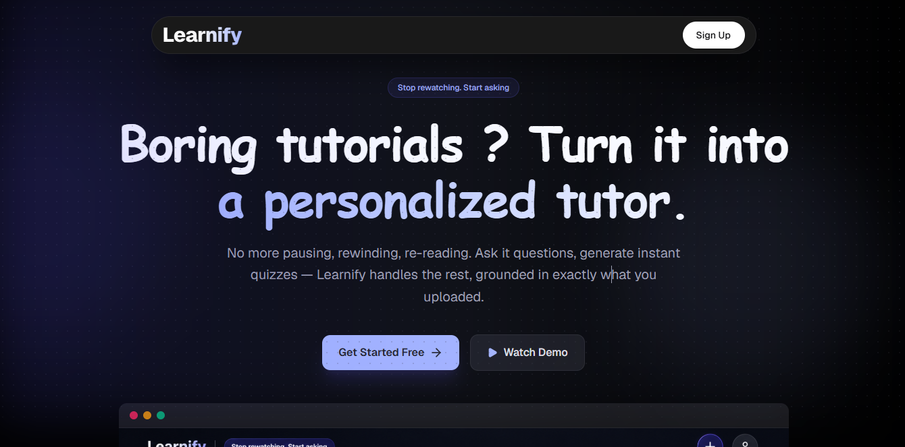
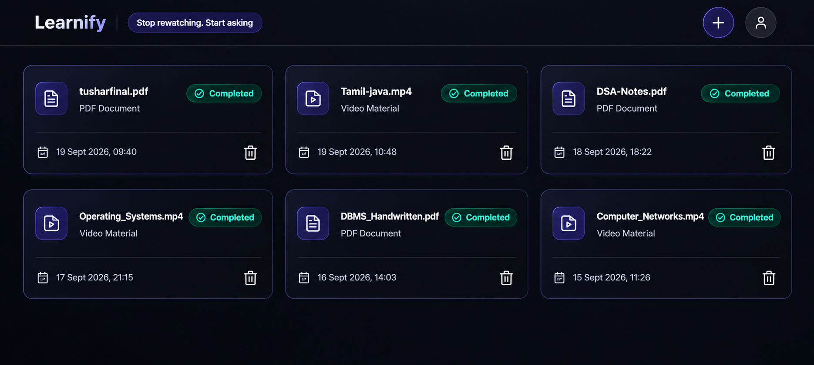

# Learnify - Turn any video or PDF into a tutor

Learnify is a distributed learning platform that ingests lecture videos and PDFs, transcribes and indexes them into a vector store, and lets you chat with your material or auto-generate quizzes from it — all backed by an async, queue-driven microservice architecture.

**Live Demo:** _coming soon_


<p align="center">
  
</p>

<p align="center">
  
</p>

<!-- <p align="center">
  
</p>
<p align="center">
  
</p> -->


---

# Architecture-


<p align="center">
  
</p>


---

## Features


- **Document Chat** — ask any natural-language question about an ingested material; performs cosine similarity search over the vector store filtered by `materialId`, injects the top-4 most relevant chunks into the prompt, and returns an answer grounded strictly in that document
- **Multilingual Video Lecture Ingestion** — upload lecture video in `.mp4`, `.mkv`, `.avi`, or `.mov` format (up to 500 MB); a dedicated Python microservice extracts audio with FFmpeg and transcribes it via **Groq Whisper** (`whisper-large-v3`), supporting 99 languages with automatic translation to English before ingestion
- **Chunked Transcription for Long Videos** — large videos are automatically split into 10-minute chunks to stay within Groq's API limits, with timestamps preserved and stitched across chunks
- **Asynchronous Processing with Job Tracking** — uploads are published to a **RabbitMQ** queue and processed in the background; each material has a unique `jobId` and transitions through `QUEUED → PROCESSING → DONE / FAILED`, pollable via `GET /materials/{id}/status`
- **Duplicate Upload Detection** — re-uploading the same filename for the same user returns `409 Conflict` with the existing job's details
- **PDF Ingestion** — parsed page-by-page, cleaned of encoding artifacts and whitespace noise, then chunked into 800-token segments tagged with `materialId`, source file, page number, and timestamp
- **Local Embeddings via Ollama** — all chunks are embedded using **Ollama** (`nomic-embed-text`) and stored in PostgreSQL with the pgvector extension
- **MCQ Quiz Generation** — retrieves up to 8 relevant chunks filtered to a similarity score above 0.75, and instructs the LLM to produce a structured JSON array of questions, each with four options (A–D), a correct answer label, and an explanation
- **Interactive Quiz Taking** — select answers, submit, and get instant feedback: correct options highlight green, wrong choices red, unanswered questions reveal the correct answer, with a per-question explanation and a score banner
- **Quiz History** — generated quizzes are persisted and retrievable later via `GET /quiz/{id}` for review
- **Google OAuth2 Authentication** — no passwords; sign-in via Google, with short-lived access tokens and long-lived (6-month) refresh tokens rotated on every use, stored in an HttpOnly cookie
- **Per-User Data Isolation** — every material, quiz, and vector chunk is scoped to the owning user; ownership is enforced at the service layer before any cross-service call
- **Semantic Search Microservice** — `rag-worker` exposes an internal-only `/internal/search` endpoint, keeping all embedding and vector-store logic in one place, never exposed publicly
- **Decoupled Status Reporting** — worker services have no direct database access; they report status changes back to `learnify-api` over a dedicated RabbitMQ queue, the only service that writes to the `material` table
- **Database-per-Service** — `learnify-api`'s relational data and `rag-worker`'s vector store live in separate Postgres databases, so no service can accidentally query another's tables
- **RabbitMQ Topology Ownership** — each service only declares the queues/bindings it consumes, and only the bare exchange for anything it merely publishes to, avoiding first-boot race conditions
- **Global Exception Handling** — custom exceptions (`ResourceNotFoundException`, `AccessDeniedException`, `DuplicateResourceException`) mapped to a consistent `ApiError` response (`message`, `httpStatus`, `timestamp`)
- **Modular Service Architecture** — clean separation across API gateway, video worker, RAG worker, and transcription services
- **Fully Containerized Stack** — Docker Compose orchestrates the API gateway, both worker services, the transcription service, PostgreSQL, and RabbitMQ as isolated, restart-safe services for one-command local setup


---


## Tech Stack


| Layer | Technology |
|---|---|
| Frontend | React |
| API Gateway | Spring Boot (`learnify-api`) |
| Video Worker | Spring Boot (`video-worker`) |
| RAG Worker | Spring Boot (`rag-worker`) |
| Transcription Service | Python (Groq Whisper, FFmpeg) |
| Messaging | RabbitMQ |
| Database | PostgreSQL (Spring Data JPA) |
| Vector Database | PostgreSQL + pgvector (Spring AI Vector Store) |
| Embeddings | Ollama (`nomic-embed-text`) |
| LLM (Chat / Quiz) | Groq (OpenAI-compatible API) |
| Auth | Google OAuth2 + JWT (access + HttpOnly refresh cookie) |
| Containerization | Docker, Docker Compose |

---

[//]: # (## Architecture)

[//]: # ()
[//]: # ()
[//]: # (---)


## API Reference

### Auth — `/auth`

| Method | Endpoint | Description |
|--------|----------|-------------|
| `GET` | `/oauth2/authorization/google` | Start Google OAuth2 login |
| `POST` | `/auth/refresh` | Rotate access + refresh token (refresh token read from cookie) |
| `POST` | `/auth/logout` | Revoke refresh token + clear cookie |

---

### Materials — `/materials`

| Method | Endpoint | Description |
|--------|----------|-------------|
| `POST` | `/materials/video` | Upload a video; queues transcription + indexing |
| `POST` | `/materials/pdf` | Upload a PDF; queues parsing + indexing |
| `GET` | `/materials/{id}/status` | Poll ingestion status for a material |
| `GET` | `/materials` | List all materials owned by the current user |

---

### Chat — `/chat`

| Method | Endpoint | Description |
|--------|----------|-------------|
| `POST` | `/chat` | Ask a question about a specific material (`{ question, materialId }`) |

---

### Quiz — `/quiz`

| Method | Endpoint | Description |
|--------|----------|-------------|
| `POST` | `/quiz/generate` | Generate a quiz from a material (`{ topic, materialId, numberOfQuestions }`) |
| `GET` | `/quiz/{id}` | Fetch a previously generated quiz |

---

### Internal — service-to-service only, not publicly exposed

| Method | Endpoint | Description |
|--------|----------|-------------|
| `POST` | `/internal/search` | `rag-worker`'s semantic search endpoint, called only by `learnify-api` |

---

## Running Locally

> Requires **Docker** and **Docker Compose** to be installed.

1. **Create the `.env` file**

   ```bash
   cp example.env .env
   ```

   Fill in the following variables:

   | Variable | Description |
      |---|---|
   | `DB_PASSWORD` | PostgreSQL password |
   | `RABBITMQ_PASSWORD` | RabbitMQ password |
   | `JWT_SECRETKEY` | Secret key used to sign JWT tokens |
   | `GOOGLE_CLIENT_ID` | Google OAuth2 client ID |
   | `GOOGLE_CLIENT_SECRET` | Google OAuth2 client secret |
   | `GROQ_API_KEY` | Groq API key (chat/quiz generation + transcription) |
   | `TRANSCRIPTION_WORKER_URL` | Transcription service URL (use the Compose service name, e.g. `http://transcript-server:8000`) |
   | `FRONTEND_URL` | Frontend origin for OAuth redirect and CORS |

2. **Build each service image**

   ```bash
   cd learnify-api && docker build -t learnifyapi-service:latest . && cd ..
   cd video-worker && docker build -t video-worker:latest . && cd ..
   cd rag-worker && docker build -t rag-worker:latest . && cd ..
   ```

3. **Run the stack**

   ```bash
   docker-compose -f docker-compose.yml up -d --build
   ```

4. **Access the app**

    - Frontend: http://localhost:5173
    - Backend: http://localhost:8080/api/v1
    - RabbitMQ Management UI: http://localhost:15672

Stop everything with:

```bash
docker-compose -f docker-compose.yml down
```

---