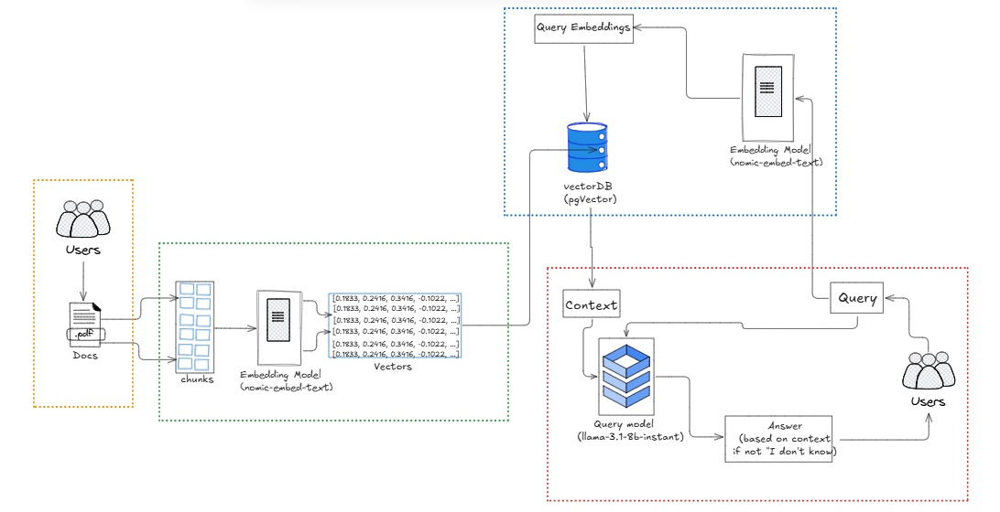

🎓 Learnify — AI-Powered Teaching Assistant

> Upload any PDF or lecture note and instantly chat with it, generate quizzes, and test your knowledge.
 
---

## 🚀 What is Learnify?

Learnify is an AI teaching assistant built with **Spring Boot + Spring AI**. It lets you upload any educational document (textbook, lecture notes, research paper) and:

- **Chat with it** — ask questions, get answers grounded in the document
- **Generate MCQ quizzes** — automatically create multiple choice questions from the content
- **Score your answers** — submit answers and get instant feedback with explanations

  

